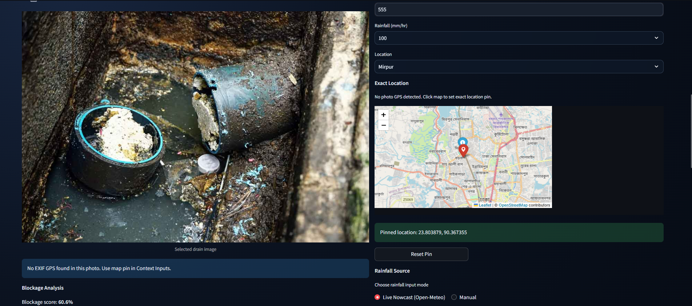
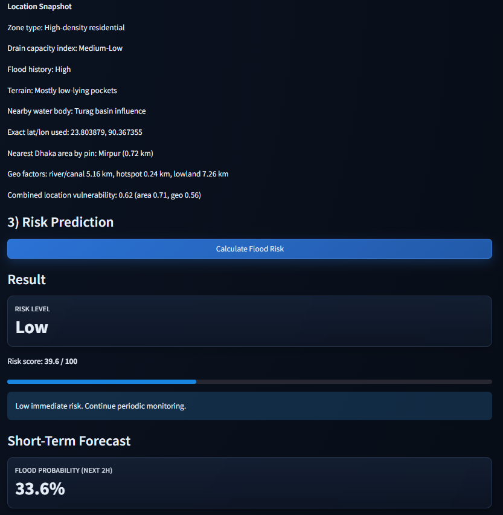
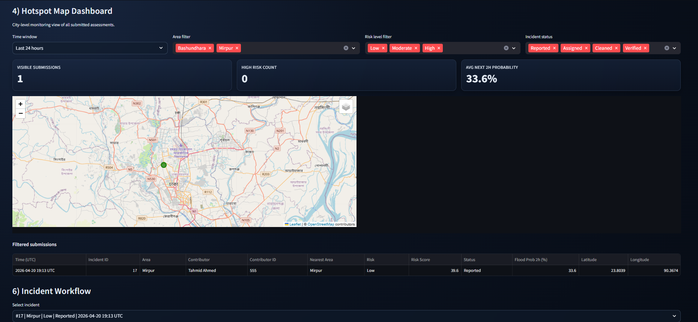
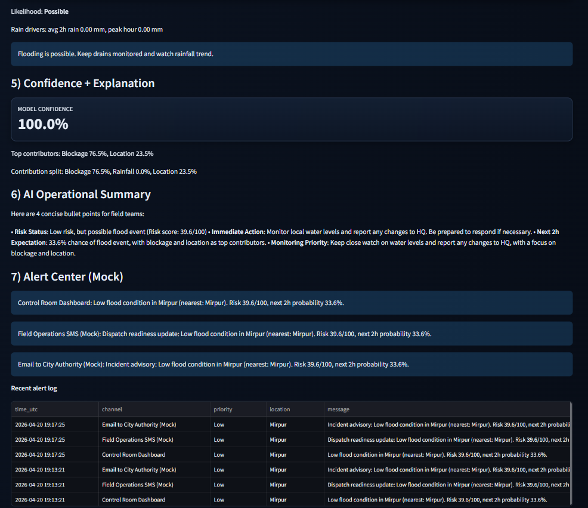
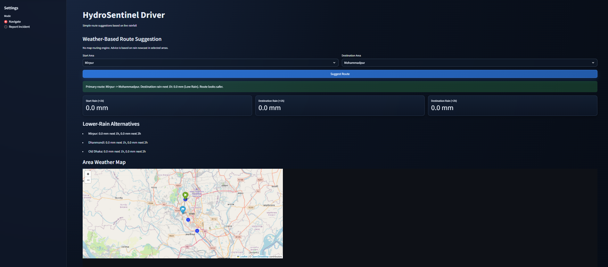

# HydroSentinel

HydroSentinel is a flood-risk intelligence platform that combines drain image analysis, rainfall nowcast, location vulnerability, and incident tracking for faster urban flood response.

It includes:
- Authority dashboard (`app.py`) for risk scoring, alerts, heatmap monitoring, and incident workflow
- Driver app (`driver_app.py`) for weather-based route advice and hazard reporting
- Core risk modules (`core/`) for CV blockage scoring, weather ingestion, and risk modeling

---

## Problem
Urban flooding often becomes visible only after roads are already waterlogged. Drain blockage, localized rainfall spikes, and vulnerable geography create high-risk conditions that are hard to detect and coordinate in time.

## Solution
HydroSentinel gives operational teams a real-time workflow:
1. Capture drain evidence (upload or live camera)
2. Detect blockage severity automatically
3. Combine with rainfall and geo-vulnerability
4. Produce risk score + next-2h flood probability
5. Generate AI summary + mock multi-channel alerts
6. Track incidents, contributors, and response status

---

## Key Features

### Authority App (`app.py`)
- Drain visual input
  - Photo upload
  - Live camera capture (start/stop controlled)
- Flood risk engine
  - Blockage score from image
  - Location vulnerability and weather integration
  - Short-term flood probability forecast
- AI operational summary
  - Local Ollama integration (`llama3.2`)
- Mock alert system
  - Control room, SMS (mock), email (mock)
  - Alert history log for demo
- Dashboard and operations
  - KPIs (risk, cleanup, top contributor)
  - City heatmap with filters
  - Incident lifecycle status updates
  - CSV / JSON / PDF export
- Contributor tracking
  - Name + contributor ID
  - Top named contributor ranking for reward programs

### Driver App (`driver_app.py`)
- Weather-based route suggestion by area
- Lower-rain alternative recommendations
- Incident reporting with map pin and optional image

---

## 📸 Screenshots & Features in Action

### Blockage Analysis & Location Selection

*Users upload drain images for automatic blockage detection and click the map to pin exact incident location.*

### Flood Risk Assessment Details

*Comprehensive risk scoring breakdown showing blockage, rainfall, and location vulnerability factors with confidence levels.*

### Hotspot Dashboard & City Heatmap

*Real-time interactive map showing all reported incidents color-coded by risk level with clustering and filtering capabilities.*

### Operational Summary & Alert System

*Authority dashboard with KPIs, incident management, status tracking, and mock alert system for rapid response coordination.*

### Driver Route Suggestions

*Weather-based navigation showing safe routes with rainfall forecasts and alternative low-rain destination recommendations.*

---

## Tech Stack
- Python 3.x
- Streamlit
- Folium + streamlit-folium
- NumPy + Pillow
- SQLite (local persistence)
- ReportLab (PDF export)
- Optional FastAPI backend (`api.py`)
- Optional Ollama local LLM (`llama3.2`)

---

## Project Structure

```text
flood-alert/
├─ app.py
├─ driver_app.py
├─ api.py
├─ requirements.txt
├─ core/
│  ├─ cv_model.py
│  ├─ rainfall.py
│  ├─ risk_engine.py
│  ├─ storage.py
│  ├─ weather.py
│  └─ route_engine.py
├─ utils/
│  └─ map_utils.py
├─ data/
│  └─ submissions.db (created automatically)
└─ DRIVER_ROUTING_GUIDE.md
```

---

## Installation

1. Create and activate a Python environment.
2. Install dependencies:

```bash
pip install -r requirements.txt
```

### Note on NumPy install (Windows)
If `numpy==2.1.2` tries to build from source and fails due to missing C compiler:
- install Build Tools, or
- pin NumPy to a wheel-friendly version such as `1.26.4`.

---

## Run

### Authority App
```bash
streamlit run app.py
```

### Driver App
```bash
streamlit run driver_app.py
```

### Optional API (if needed)
```bash
uvicorn api:app --reload
```

---

## Ollama Setup (Optional AI Summary)
HydroSentinel can generate incident summaries with local LLM.

1. Install Ollama
2. Pull model:
```bash
ollama pull llama3.2
```
3. Start service:
```bash
ollama serve
```

If Ollama is unavailable, the app continues and shows a fallback note.

---

## End-to-End Demo Flow

1. Open authority app.
2. Enter contributor name/ID.
3. Upload or capture a drain image.
4. Set location and rainfall source.
5. Click **Calculate Flood Risk**.
6. Observe:
   - Risk score and probability
   - AI operational summary
   - Mock alert center
7. Check dashboard heatmap and incident workflow.
8. Export incident report as CSV/JSON/PDF.

---

## Business Model Potential
HydroSentinel can be positioned as GovTech SaaS for municipalities and response agencies.

Revenue options:
- Per-city subscription
- Premium analytics module
- API/data licensing
- Seasonal emergency response package

Scalability:
- Multi-city rollout using area configuration + shared core engine
- Modular architecture (CV, weather, risk, alerting, dashboard)
- Crowdsourced contributor network increases data coverage over time

Sustainability impact:
- Earlier intervention reduces flood damage and response cost
- Contributor incentives encourage community participation
- Operational transparency supports better resource allocation

---

## Troubleshooting

### 1) Result appears/disappears
The app uses session state to persist risk output. If behavior returns, restart Streamlit and clear cache.

### 2) Import resolution errors in editor
If editor shows unresolved imports (`streamlit`, `folium`, `PIL`, etc.), verify the active Python interpreter/environment in your IDE.

### 3) Camera not opening
Use **Start Live Capture** in the visual input panel. Browser camera permissions must be allowed.

### 4) Ollama summary missing
Ensure:
- `ollama serve` is running
- `llama3.2` is installed locally

---

## Future Enhancements
- Real alert integrations (SMS gateway, email service, webhook)
- Authentication and role-based access
- Mobile-first field app
- Route engine with traffic + flood fusion
- Multi-tenant deployment for multiple cities

---

## License
This project is licensed under the **MIT License** - see the [LICENSE](LICENSE) file for details.

### MIT License Summary
You are free to:
- ✅ Use this software commercially
- ✅ Modify and distribute
- ✅ Use privately
- ⚠️ Include a copy of the license and copyright notice

### Copyright
Copyright (c) 2026 HydroSentinel Contributors

---

## Attribution & Credits
- **Open-Meteo**: Free weather data (no attribution required)
- **Folium**: Map visualization (BSD 3-Clause License)
- **Streamlit**: UI framework (Apache 2.0)
- **Pillow & NumPy**: Image & numerical computing (MIT/BSD licenses)
